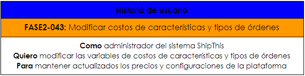

# Actividad 4 para la materia Desarrollo del Software

## Instrucciones

#### Se deben configurar los webdriver de chrome

##### Para ejecutar las pruebas ir a la ruta raíz del proyecto y ejecutar el siguiente comando: 
##### `npm test ./tests/Actividad/pruebaNUMERODELAPRUEBA.spec.js`

## Historia de usuario elegida

## Escenarios de prueba

#### Cambio de la configuración del costo

####Cambio de los costos de los tipos de órdenes

## Pruebas E2E

## Software utilizado

  
  
  

## Proyecto utilizado en la prueba

  

## Autor

- Anthony Rodriguez :gem: - [thonygrz](https://github.com/thonygrz)